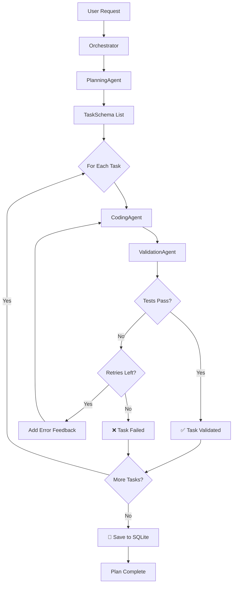
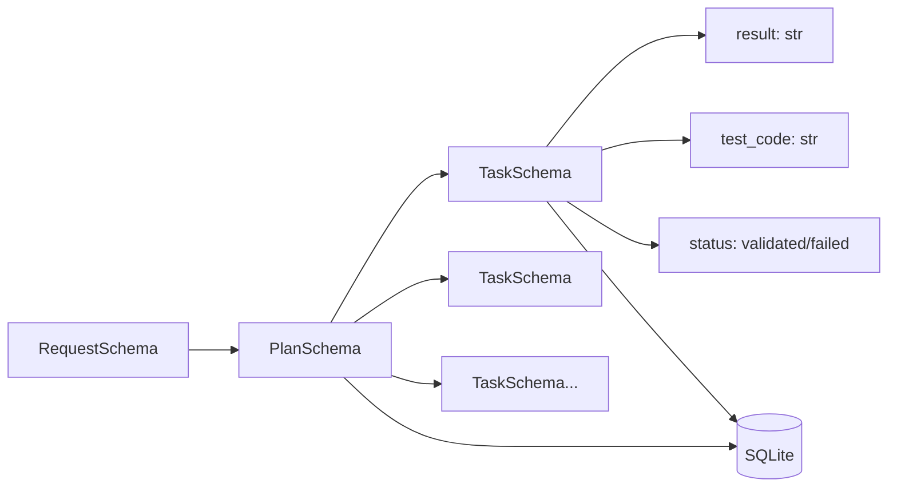
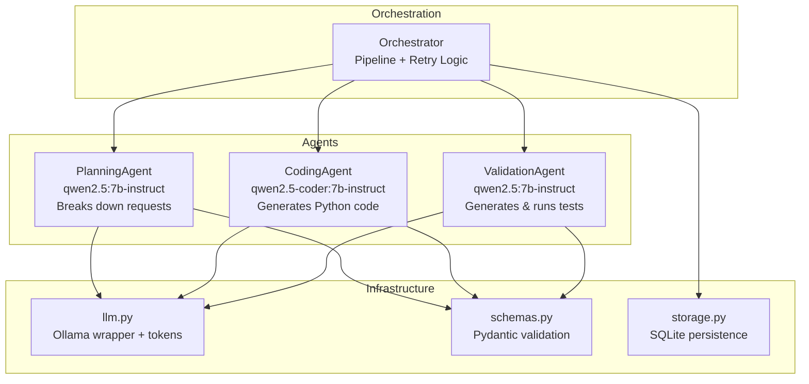
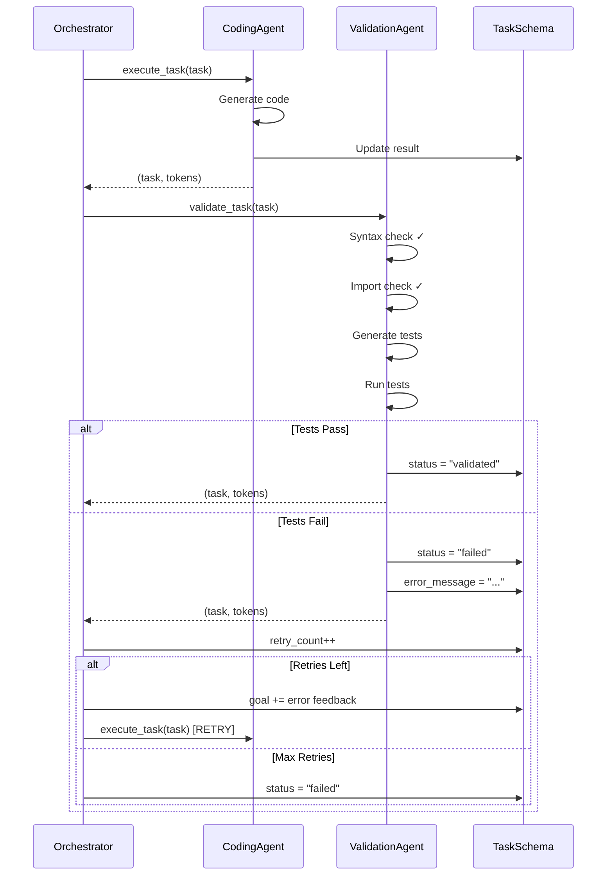
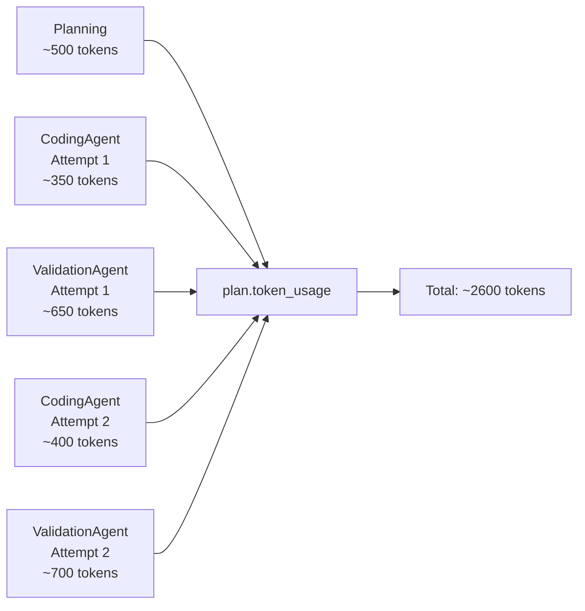
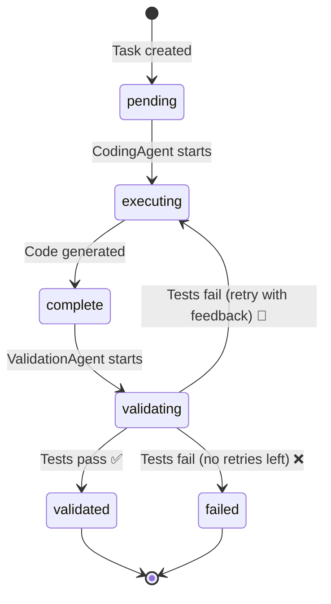
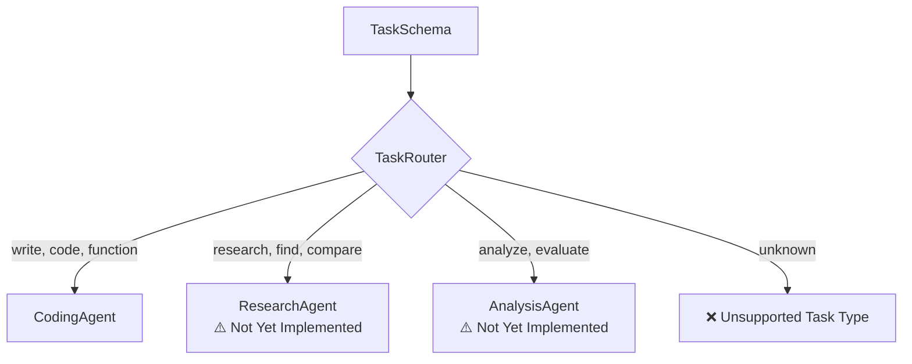

# AI Intern Architecture

## System Overview


## Data Flow


## Component Responsibilities


## Retry Flow Detail


## Token Flow


## File Structure
```
project/
├── main.py              # Entry point (uses Orchestrator)
├── agents.py            # All agent classes
│   ├── PlanningAgent
│   ├── CodingAgent
│   ├── ValidationAgent
│   └── Orchestrator
├── llm.py               # Ollama wrappers
│   ├── call_ollama()
│   ├── call_ollama_code()
│   └── call_ollama_structured()
├── schemas.py           # Pydantic models
│   ├── RequestSchema
│   ├── PlanSchema
│   └── TaskSchema
├── storage.py           # SQLite operations
│   ├── save_plan_to_sqlite()
│   └── load_plan_from_sqlite()
├── inspect_results.py   # Debug tool
└── ai_intern_db.sqlite  # Database
```

## Status State Machine


## Future: Task Router (Not Yet Built)
